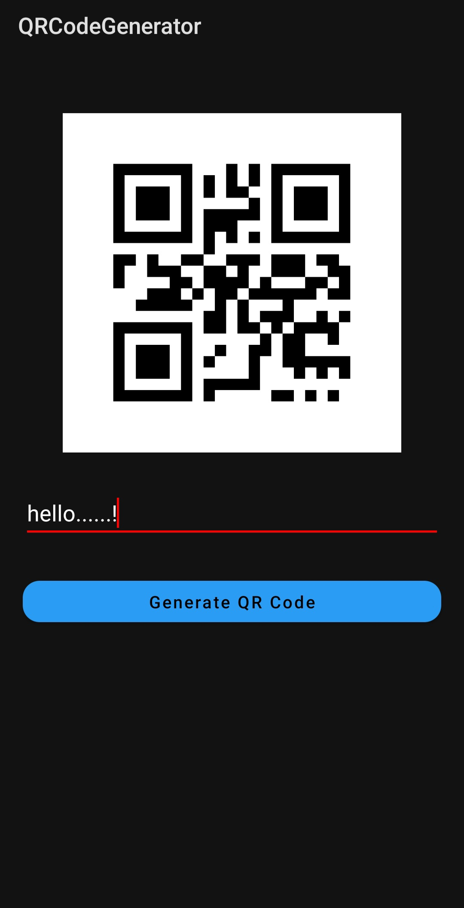

# Android-Study-Jams

# QR-Generator

<b> Problem Statement: </b>

Now a days everywhere peoples are using QR code Because QR code is store lots of information and that information are not directly human readable. if humans want to read that information then they need QR Code scanners so everyone wants there own QR code for store information or do some fun activitys.

<b> Proposed Solution : </b>

"QR Code generator" It is a tool that is used to generate different types of QR Codes. Depending on your purpose, you can use our generator to create QR Codes to open a website, view a PDF file, listen to music, watch Youtube videos, store image files, connect to a WiFi network, and much more.

    	  	
<b> Functionality & Concepts used : </b>

- The App has a very simple and interactive interface which helps the user to Easily generate QR Codes.

- Simple & Easy Views Design.

<b> Application Link & Future Scope : </b>
- Augmented reality
- Displaying multimedia contents
- Virtual stores
- QR code payment
- Joining a Wi‑Fi network
- Restaurant ordering

App Link : https://drive.google.com/file/d/1yhywuGId9ZtuljYQEEDGNrjgdE7aMR5n/view?usp=sharing.
